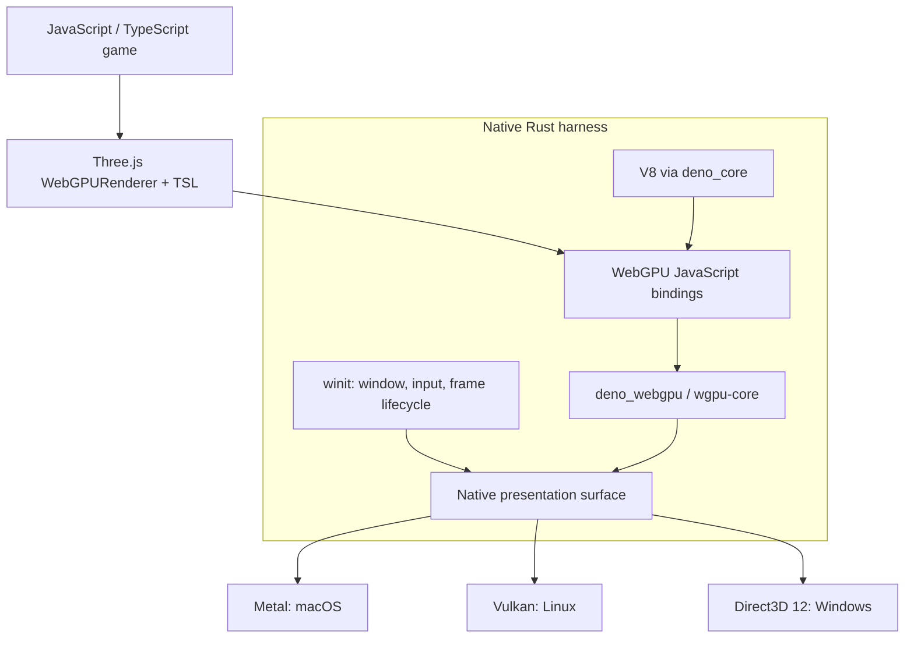

# 3JSN — Three.js Native

An open-source project exploring a **native game engine for JavaScript and
Three.js**, with performance as the first design constraint.

The intended runtime renders through Metal, Vulkan, and Direct3D 12. It embeds a
JavaScript engine and uses native windows. It does not embed a browser or WebView.

**Status: research and executable probes. The integrated game runtime does not
exist yet.** No desktop platform is currently certified as supported.

## Proposed architecture



Rust owns the application lifecycle and platform integration. V8 executes the
game and Three.js. The graphics layer translates WebGPU commands and shaders to
native APIs; the game itself is not translated into Rust.

The proposed binding reuse must be proved with a compatible dependency graph and
a window surface owned by the same GPU instance. See the
[architecture decision](docs/adr/0001-rust-native-webgpu.md).

## Start here

- [Research and alternatives](docs/research.md): precedents, primary sources, tradeoffs.
- [Architecture](docs/architecture.md): ownership, frame loop, and performance strategy.
- [Roadmap](docs/roadmap.md): milestones with explicit acceptance criteria.
- [Compatibility](docs/compatibility.md): the intended web API boundary.
- [Benchmark protocol](docs/benchmarks.md): how we will judge performance.
- [Initial validation](docs/validation/2026-09-17.md): measured results and gaps.

## Run the research probes

Prerequisites: Node.js 24+ for the JavaScript experiment; Rust 1.92+ and a native
compiler/linker for the Rust diagnostic. GPU commands need access to a real GPU.

```sh
npm ci
npm run check
npm run doctor
npm run probe:gpu

cargo run --locked -p threejs-native-gpu-probe
```

`probe:gpu` renders an animated Three.js scene through Node's Dawn binding to a
native GPU texture, verifies changing pixels, and writes PNGs and a JSON report
to `artifacts/native-webgpu/`. It is an offscreen correctness baseline, **not a
native-window demo or a benchmark**. Node and Dawn are experimental tooling, not
the proposed shipping runtime.

The Rust diagnostic independently opens a `wgpu` adapter and device. It does not
execute JavaScript or render the Three.js scene. These two experiments are not
connected yet.

The probes select Metal on macOS, Vulkan on Linux, and D3D12 on Windows. Drivers
and hardware must support the selected backend. For the JS experiment, an
explicit `THREEJS_NATIVE_BACKEND` environment variable can select one of those
three backends; no WebGL or software-rendering fallback is requested.

## Project direction

First, prove an efficient native runtime for upstream Three.js. Then build the
engine services around it: assets, input, audio, fixed-step simulation, physics
integration, packaging, and development tools. Keep ordinary Three.js scenes
portable and isolate native capabilities behind explicit APIs.

Related projects already demonstrate this category, including
[Mystral Native](https://github.com/mystralengine/mystralnative),
[Deno WebGPU window demos](https://github.com/chirsz-ever/deno-webgpu-window-demos),
and [Babylon Native](https://github.com/BabylonJS/BabylonNative). 3JSN aims to earn
its place through a focused Three.js developer experience and measured native
performance. It does not claim to be the first browserless JavaScript renderer.

MIT licensed. Independent project; no affiliation with Three.js or the named
dependencies is implied. The package is private while the design is exploratory.
