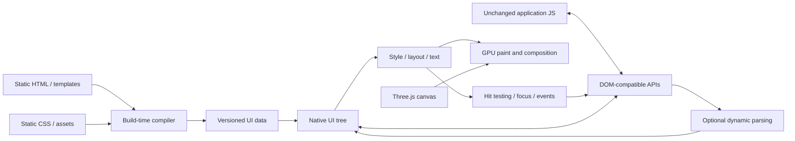

# ADR 0003: Compile UI inputs while preserving generic application behavior

- Date: 2026-09-18
- Status: direction accepted; initial-tree construction prototype verified; parser omission remains unimplemented
- Extends: [ADR 0002](0002-unchanged-project-compatibility.md)

## Decision

3JSN targets existing Three.js applications, independent of a particular game or
UI framework. CtF is one demanding acceptance workload. Its element IDs, screen
structure, build system and dependencies must not become runtime requirements.
Compatibility is defined by documented web-platform capabilities and tested with
redistributable fixtures plus independently structured applications.

HTML and CSS are UI authoring inputs. Compile static inputs into native UI data
where behavior can be preserved. Keep the source unchanged and record generated
transformations. Prefer maintained parser, style, layout, text and paint components
over a new implementation of those standards.

The target is an application runtime with native GPU presentation. A general
browser, Chromium/CEF process or OS WebView is not the default delivery mechanism.
Existing JavaScript still requires the observable DOM and CSS behavior of its
supported compatibility profile. Renaming that behavior does not remove it.

## Build and runtime boundary

The compiler may emit node templates, attributes, text, style rules, asset
references and source locations. Do not freeze a binary format before proving a
supported construction API into the maintained runtime. Loading compiled data
must validate its version, bounds, references and required runtime capabilities.
Do not serialize Rust pointers or private dependency structures as a package ABI.

The runtime owns live node identity, mutation, selectors, events, style
invalidation, responsive layout, text shaping and input. Final positions and GPU
commands usually depend on runtime state, window size and fonts. Compiling HTML
does not make those results immutable or move all UI work onto the GPU.

## Parser omission is a capability decision

| Application behavior | Intended treatment |
| --- | --- |
| Static document and styles | Compile initial structure and rules; preserve document mode, namespaces and source behavior |
| `createElement`, `appendChild`, `textContent`, class updates | Operate on the native tree through compatible APIs; no HTML string parser is inherently required |
| A provably constant markup fragment | Compile a template only when its parsing context and observable effects are preserved |
| Arbitrary `innerHTML`, `insertAdjacentHTML`, `DOMParser` or fetched markup | Retain the relevant runtime parser when supported; otherwise report an unsupported capability |
| Runtime CSS strings, stylesheet insertion or selector strings | Retain their required grammar processing independently of HTML parsing |
| Dynamic imports or dependencies whose behavior is unresolved | Keep conservative capabilities or fail an explicitly restricted build; absence in a source search is not proof |

Parser omission applies to a particular grammar and artifact. An artifact without
the HTML parser may still need CSS declaration, selector, URL and shader parsers.
Removing parsers does not remove the live tree or the APIs applications observe.

The default compatibility path favors preserving behavior. A restricted artifact
may omit a parser only after the build establishes that no reachable supported
operation requires it, or under an explicit restrictive profile with actionable
diagnostics. Runtime observations help find requirements but do not prove that an
untested path cannot execute. Do not rely on a regex search or one game run to
delete capabilities.

Do not rewrite dynamic markup interpolation into text assignment automatically:
markup and text have different behavior. Constant fragment compilation must
account for context elements, namespaces, node replacement/identity and mutation
ordering. HTML setters are parsing operations under the
[HTML standard](https://html.spec.whatwg.org/multipage/dynamic-markup-insertion.html#the-innerhtml-property).

## Incremental delivery and evidence

1. Keep the current interpreted HTML experiment as a comparison and packaging
   baseline. Its live DOM, HTML/CSS parsing and fixed `#scene` fixture contract
   remain experimental; they do not define the final product's markup grammar.
2. Prototype loading compiled static UI data into the same authoritative tree.
   Compare browser, interpreted-native and compiled-native results for document
   structure, queries, text, events, mutations, resizing and GPU output.
3. Prove optional HTML-parser linkage using a small compiled fixture. Record the
   final dependency/link evidence, artifact size, startup time and runtime memory.
   Preprocessing HTML while still shipping its parser is not parser omission.
4. Extend proven template transformations and dynamic capability diagnostics.
   Test both parser-enabled and parser-omitted artifacts. Keep style evaluation
   dynamic where CSS variables, state or viewport changes require it.
5. Expand the corpus with independent plain DOM, framework-generated tree,
   string-generated markup and dynamic-style workloads, plus WebGL/WebGPU and
   multiple-canvas applications. Framework support requires its own evidence.
   CtF adds an end-to-end application test without introducing game-specific
   branches into the engine.

The [initial-tree checkpoint](../validation/2026-09-18-compiled-ui.md) now compiles
static HTML through parse5 into bounded, versioned experimental JSON and constructs
the authoritative Blitz document through public mutation APIs. Five generic
fixtures match the interpreted-native construction path; browser comparison
remains partial. One compiled fixture presents 120 Metal frames with reads of its
original HTML denied, while retaining dynamic `innerHTML` behavior.

This proves the construction portion of step 2, not the complete comparison or
step 3. The prototype retains CSS and HTML parsers, drops native DocumentType
nodes explicitly and rejects unsupported document modes. Script discovery,
resource packaging, framework coverage and a shipping data format remain open.
No footprint or performance improvement is claimed before measurement.
