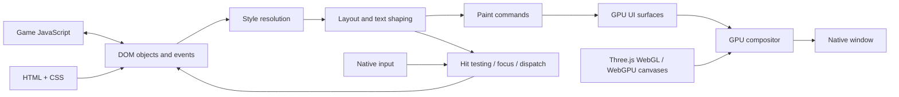

# HTML/CSS and native GPU composition

Status: research, 2026-09-18. The [source investigation and executable comparisons](investigations/html-dom.md)
update the candidate assessment below. HTML/CSS compatibility is required by the
[unchanged-project contract](product.md). Isolated V8/Blitz/Vello probes now paint
live HTML and native Three.js canvases. They are not integrated shipping support.
The [current DOM canvas evidence](validation/2026-09-18-canvas-handoff.md) verifies
matching canvas contracts, initialized GPU handoff and several composition behaviors.
A pinned stacking-list repair passes repeated transitions; the ancestor clipping
gate remains open.
The [22-case overflow comparison](validation/2026-09-18-overflow.md) also exposes
stale hoisted positions and missing containing-block ownership. A paint-only
prototype was not adopted because its fallbacks and effect handling remain unsafe
to treat as supported behavior.

## The complete pipeline

DOM APIs and rendering must agree. JS mutates elements, classes, style and text,
reads geometry, registers callbacks and changes focus. A static screenshot of
HTML cannot supply those behaviors. Preserve object identity and use one coherent
application event model. If V8 owns game execution, the DOM bridge must integrate
with that realm; selecting a different engine may require revisiting V8.

## Candidates

| Candidate | Useful capability | Missing decision |
| --- | --- | --- |
| [Blitz](https://github.com/DioxusLabs/blitz) | Modular Rust HTML/CSS stack; bounded V8 DOM, native text/paint and canvas probes work here | Full DOM semantics, ancestor clipping and sustainable binding/patch scope remain gates |
| [Vello](https://github.com/linebender/vello) | GPU 2D painting component | Not an HTML parser, DOM, CSS layout engine or input system |
| [Servo](https://book.servo.org/embedding/overview.html) | Embeddable web engine with more integrated web semantics | It is a browser engine, not a lightweight renderer swap; evaluate embedding, compositor and JS-engine implications |
| [RmlUi](https://github.com/mikke89/RmlUi) | Game-oriented UI using HTML/CSS-like documents | Its own document/binding model does not establish unchanged browser DOM compatibility |

Blitz is a promising first component investigation, not an adopted dependency.
Its stack includes Stylo, Taffy and Parley, but a renderer demo does not establish
that CtF's live UI works. Servo's [SpiderMonkey integration](https://servo.org/blog/2024/04/15/spidermonkey/)
also means it cannot be treated as a drop-in DOM attached to our V8 runtime.

## Required experiments

1. Build redistributable fixtures for element mutation, selectors, `innerHTML`,
   class/style updates, bubbling/cancellation, focus and synchronous geometry reads.
2. Exercise actual required styling: flex/grid, positioning, variables, fonts,
   gradients, pseudo-elements, animation, transforms, clipping, scrolling and
   filters. Record unsupported behavior rather than silently approximating it.
3. Draw live Three.js canvases among HTML elements, including multiple canvases,
   transparent layers and Canvas 2D. Honor stacking order, clipping, opacity,
   transforms, device pixel ratio and color/premultiplied-alpha conventions.
4. Test pointer/keyboard/controller navigation, forms, selection, text input/IME,
   scrolling and accessibility. Input and painted coordinates must agree.
5. Profile layout invalidation and painting. Reuse text/paint caches and dirty
   regions; compare redraw-on-change with dynamic animated UI. Synchronous layout
   queries are potential stalls and must be measured rather than removed.

## GPU interoperability

The wgpu compositor and HTML painter should share compatible GPU ownership when
possible. The WebGL compatibility path may use ANGLE, whose context/device can
differ. Prototype native texture sharing and synchronization on each backend before
promising zero-copy. An explicit GPU copy may be necessary; record its cost.
Continuous CPU readback/upload of game frames is not an acceptable shipping path.

ANGLE's [backend matrix](https://github.com/google/angle) includes Metal, Vulkan
and D3D11 paths. Do not assume its Windows path is D3D12 just because wgpu uses
D3D12 for WebGPU. Backend selection must account for compatibility and composition.

## Decision gate

Choose the smallest maintained combination that meets the compatibility profile
with a sustainable binding surface. Record license/dependency footprint, required
patches, runtime behavior and profiling results. If arbitrary DOM compatibility
forces a full web-engine design, make that tradeoff explicit before implementation.
