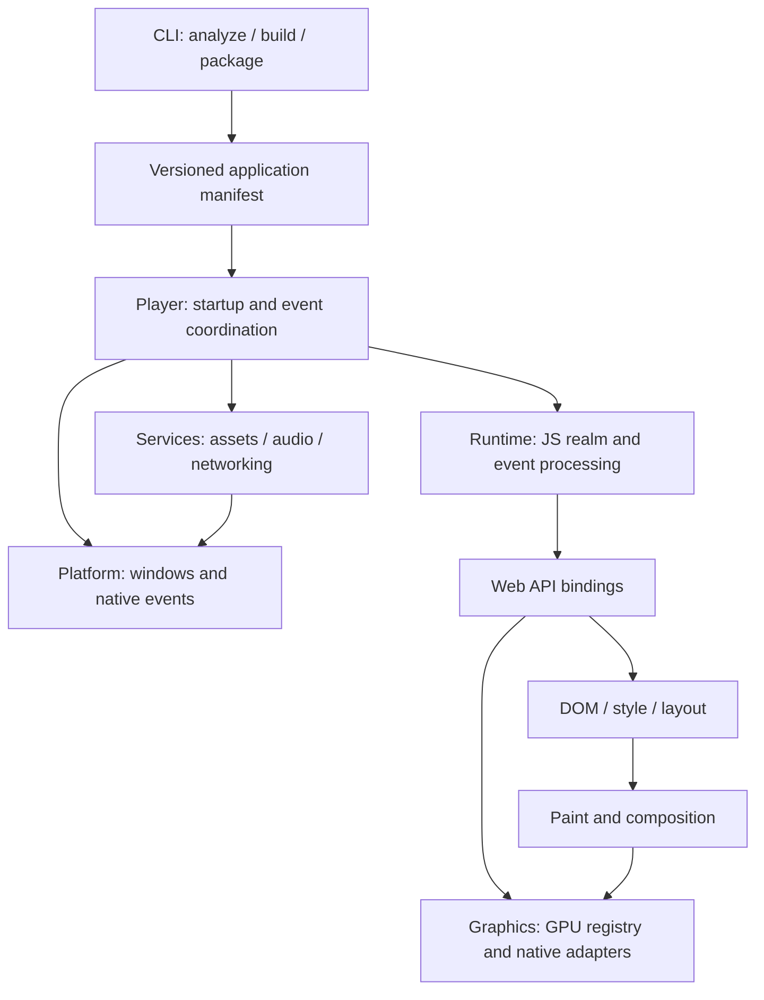

# Module contracts and ownership

Status: architecture contract. Implemented modules are identified in the repository;
this map does not imply the full runtime exists.

## Dependency direction

The CLI may launch a player but the shipping player never imports build tooling.
Platform code does not call into an application JS isolate directly. The player
coordinates events and forwards typed messages. Bindings adapt library objects;
gameplay and Three.js behavior stay in the application. Do not introduce a shared
service locator to bypass these directions.

## Owners and lifetime

| Boundary | Owner and contract | Failure and teardown |
| --- | --- | --- |
| Application manifest | CLI writes version, profile, entry points, asset identities and target requirements; player validates before starting | Reject incompatible versions or missing required capabilities before launch |
| OS windows/events | Platform on its required event thread; dimensions are drawable physical pixels, input records its coordinate space | Stop new events before releasing windows; retain handles until every surface is dropped |
| JS realm | Runtime on its creating thread; all application DOM/GPU objects belong to that realm | Stop callbacks, cancel owned async work, release persistent V8 handles, dispose the isolate, then release retained native surface/window owners |
| GPU registry/device | Graphics adapter shared by JS bindings and composition; handles are typed and scoped to their owner | Validate compatible adapter/surface, invalidate acquired textures after present, report device loss; never mix registries |
| DOM and layout | DOM adapter owns node identities, event dispatch and layout invalidation | Detach listeners and native resources with document disposal; preserve observable node identity while reachable |
| Service operation | Named service owns a bounded queue and a cancellation handle | Complete once with a value, typed failure or cancellation; never call a disposed realm |
| Frame dispatch | Player requests one frame; runtime dispatches callbacks with one monotonic timestamp | Snapshot callbacks, allow cancellation during dispatch, defer new callbacks until another frame; report exceptions without losing later callbacks |

The offscreen player drains referenced async work. The interactive adapter now
uses one current-thread reactor on a dedicated worker, a coalescing OS-state
channel, and thread-safe V8 cancellation. Its surface and window ownership is
described in [the native-window contract](native-window.md). Opaque presentation
and a [bounded native input queue](native-input.md) have one-Mac evidence; wider
lifecycle and DOM-input gates remain open. General service queues are still a
subsequent implementation gate.

## Errors and capabilities

Use typed Rust error variants at public boundaries. Preserve causes and JavaScript
stack/source locations; format a human message at the CLI boundary. Distinguish
invalid project, unsupported capability, unavailable hardware, asset failure,
JavaScript exception, cancelled work and fatal host failure. Do not turn any of
these into an unexplained blank frame or successful compatibility report.

Capability reports name the profile and exact feature, status, platform/backend
and supporting evidence. `unknown` differs from `unsupported`, and compile success
differs from hardware verification. Diagnostics identify the originating file/API
where known and the next useful action. Runtime detection supplements static
analysis; neither may silently authorize an unsupported feature.

## FFI and library adapters

Keep raw pointers and upstream resource IDs private to adapters. Every unsafe
block must state the specific lifetime, thread or aliasing invariant established
at that call. Use one deliberate release path for callbacks and handles. Avoid
cross-thread synchronous JS calls, locks held while calling application code and
unbounded render/service queues.

Expose only contracts that have consumers and tests. A stable plugin ABI, global
ECS and generic backend framework are not prerequisites for the first player.
Changes to these boundaries need an ADR with compatibility and maintenance costs.
