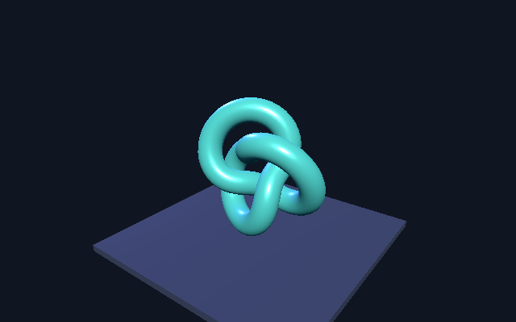

# Initial validation — 2026-09-17

Machine: Apple M1 Pro, macOS 26.1 (25B78), arm64.
Node: 24.13.0. Rust/Cargo: 1.93.0.

## Three.js → Dawn → Metal

Command: `npm run probe:gpu`

Dependencies: Three.js 0.186.0, `webgpu` 0.6.1, `pngjs` 7.0.0.

Result: PASS with native GPU access. The adapter reported Apple M1 Pro / Metal 3
and `isFallbackAdapter: false`. Two 640 × 400 frames rendered through the WebGPU
backend. The geometry check found 57,384 foreground pixels; 20,105 pixels changed
between animation times 0 and 1 seconds. No captured GPU validation/device errors.
Both frame captures were inspected visually.



The complete [JSON result](metal-threejs.json) is committed with this note. Fresh
runs write to the ignored `artifacts/native-webgpu/` directory.

This establishes browserless **offscreen rendering** using Node and Dawn. It does
not validate the proposed Rust/V8 bridge, a native presentation surface, input,
or any performance advantage. Readback exists for the correctness capture only.

The first sandboxed attempt could not obtain a Metal adapter. Running with native
GPU access succeeded. A missing adapter must remain an error rather than becoming
a software-rendering pass.

## Rust → wgpu → Metal device

Commands:

```sh
cargo check --workspace --locked
cargo run --locked -p threejs-native-gpu-probe
```

Result: PASS. wgpu 28.0.0 selected Apple M1 Pro, Metal, IntegratedGpu and created a
device. The reported maximum 2D texture dimension was 8,192 with the requested
default limits; this is not a claim about the hardware's full capabilities.

The Rust diagnostic initializes the GPU only. It does not render, embed V8,
execute Three.js, or open a window. Its dependency version was selected to work
with the installed compiler. The eventual Deno WebGPU integration needs its own
matched dependency graph and may use a different wgpu version.

## Repository checks

- JavaScript syntax, JSON, local document links, and lockfile alignment: checked
  by `npm run check`.
- Rust formatting and compilation: `cargo fmt --all --check` and `cargo check`.
- Rust linting: `cargo clippy --workspace --locked -- -D warnings`.
- Git whitespace: `git diff --cached --check` before the initial commit.

These checks do not execute the GitHub Actions workflow. Windows/Linux compilation
and hardware validation remain unverified. No browser/native performance
comparison has been run. The next integrated proof is M1 in the roadmap.
