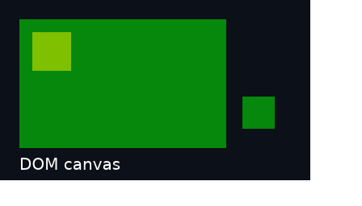

# Initialized canvas handoff and stacking repair — 2026-09-18

**Metal experiment: stacking demotion is fixed; ancestor clipping still fails.**
The canvas handoff now initializes missing contents through the producer's public
WebGPU API. It no longer assumes the application fully clears its render target.
This is an isolated integration proof, not a shipping compatibility profile.

[Machine evidence](2026-09-18-canvas-handoff.json) ·
[Reproduce](../../experiments/dom-canvas/README.md) ·
[Original failing baseline](2026-09-18-dom-canvas.md)

## Stacking-context demotion

The [one-line pinned Blitz patch](../../experiments/dom-canvas/patches/blitz-stacking-demotion.patch)
clears the obsolete local stacking list when children propagate to a parent.
It changes no application CSS, shaders, or paint ordering rules.

The CPU regression fails on unmodified upstream with two paint occurrences where
one is required. With the patch it passes 24 parent z-index transitions, checking
both a positive-z canvas and a negative-z ordinary box on every transition.
On Apple M1 Pro / Metal, eight repeated `0 → auto` transitions each paint a
half-transparent canvas and ordinary HTML box once. Every sampled result is
RGBA `[6,136,12,255]`; the original duplicate blend was `[3,196,6,255]`.

This resolves the reproduced defect in [#53](https://github.com/PANDORMedia/3JSN/issues/53)
within the pinned adapter. No upstream PR or release is claimed. The preparation
script archives the immutable Blitz commit, applies the patch, and verifies all
414 tracked files against their original Git blobs or the expected patched hash.
All six related Blitz workspace crates resolve to that same copy. Preparation
was repeated successfully and deliberately modified patch output was rejected.

## Canvas initialization

`canvas_init.rs` records an empty render pass with Load/Store operations in Deno's
original wgpu registry. The normal initialization tracker zeroes missing or
previously discarded subresources and preserves already initialized pixels.
The queue submission precedes the retained native snapshot on the exact same
Metal queue. This adds no JS usage bits, CPU pixel transport, or completion wait.

The full-pixel hardware checks cover:

| Case | Result |
| --- | --- |
| Untouched canvas | All pixels transparent zero |
| One-pixel upload | Uploaded red pixel preserved; all others zero |
| Fully written canvas | All existing color/alpha values preserved |
| Render pass with StoreOp::Discard | All subsequent exported pixels zero |
| Discard followed by a partial upload | Uploaded pixel preserved; all others zero |
| Unsupported usage without RENDER_ATTACHMENT | Rejected before export |
| Destroyed source | Rejected; temporary view ID cleaned up |
| Valid untouched canvas after errors | All pixels zero; no unexpected GPU error |

Six valid 400×240 cases check **576,000 pixels**. The two invalid cases return
specific errors. These initialization cases use RGBA8; partial updates use
`queue.writeTexture`. Existing Three.js rendering separately exercises BGRA8.
Tests continue successfully afterward. The 27 shared browser
canvas assertions still match Chrome, including rejection of JS COPY_SRC when
not requested. The first 12 original composition captures remain byte-identical.

The initialization pass uses public core APIs and adds no Deno patch. Temporary
view, encoder and command-buffer IDs are released on each failure path and after
submission. Submitted work retains its GPU resources. The source stays rooted
until the host snapshot is submitted, and both registries drain before teardown.
The separate injected failure after two frames still reaches completed cleanup.

The scope is ordinary Deno-created, single-layer/mip/sample 2D render-attachment
canvases. Other configured usages and HAL-imported producer textures remain
unsupported. In particular, importing pre-cleared native images is not a general
replacement: a later discard may require an initialization clear mode that those
imports do not have. The cross-registry ownership/serialization boundary remains
explicitly unsafe even though the application full-clear assumption is removed.

The scene sequence still uses 17 snapshot updates / 5,504,000 copied GPU bytes;
initialization assertions add 2,304,000 snapshot-copy bytes. There is now an extra
empty load/store pass for each export, plus conversion and Vello atlas copying.
Its performance has not been benchmarked. A future upstream initialization hook
may avoid the render pass while retaining the original tracker and resource owner.

## Remaining clip gate and verification

[#52](https://github.com/PANDORMedia/3JSN/issues/52) still fails unchanged. The
underlying executable exits one after saving `status:partial`; the runner checks
this known failure and all the new passing gates. The evidence has 21 captures,
including eight transition captures, with zero unexpected GPU validation errors.

A generic clip fix needs the applicable containing-block chain, current transforms
and scrolling. Pinned Blitz currently maps fixed positioning to absolute and has
no authoritative resolved absolute/fixed containing-block identity. Clipping every
DOM ancestor would introduce incorrect behavior: positioned descendants can
[escape intermediate overflow clips](https://www.w3.org/TR/CSS22/visufx.html#overflow-clipping).
See the concrete design constraints in the #52 issue. No CSS workaround is adopted.

Strict Clippy for all experiment targets, Rust formatting and the CPU regression
pass. A pre-existing dead-code warning in Blitz's disabled intrinsic-background
branch remains visible as a dependency warning. Metal API Validation was enabled.
The preceding published commit's Linux/macOS/Windows CI passed; hosted source
checks do not validate this isolated GPU experiment. Native presentation/input,
full DOM/IDL/GC, other rendering backends and unchanged-game packaging remain open.
