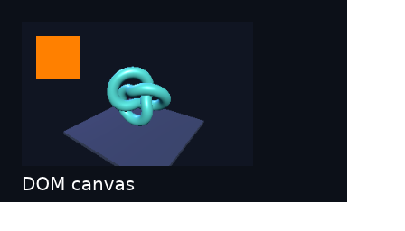
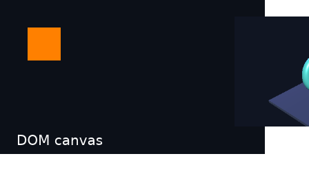
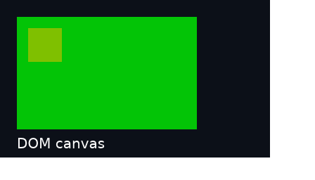

# DOM canvas integration — 2026-09-18

**Partial result on Apple M1 Pro / Metal.** Genuine DOM canvas objects now connect
upstream Three.js r186 to native GPU textures and Blitz/Vello's HTML paint order.
Two HTML paint correctness gates fail. No compatibility profile is certified.

[Machine evidence](2026-09-18-dom-canvas.json) ·
[Executable probe and reproduction](../../experiments/dom-canvas/README.md) ·
[Chrome baseline](../../fixtures/webgpu-canvas/reference-macos-arm64.json)

## Verified behavior

The same original canvas contract passes 27 matching assertions in Chrome
153.0.8010.50 and Rust-hosted V8. The browser wrapper adds three environment/error
assertions, for 30 total. The shared checks cover identity/brands, dimensions,
CSS versus bitmap size, two contexts, pixel contents, reconfiguration, resize,
unconfigure, DOM removal/reinsertion, texture expiry, and rejection of unrequested
COPY_SRC operations. The source hash in both reports matches.

Assigning the same width resets the drawing buffer; changing CSS size does not.
These contracts follow the [HTML canvas definition](https://html.spec.whatwg.org/multipage/canvas.html)
and [WebGPU canvas API](https://gpuweb.github.io/types/interfaces/GPUCanvasContext).
Only the exercised cases are established, not full WebIDL or browser conformance.

The native paint sequence submits 17 canvas updates and saves 13 448×256 captures:

- Three.js draws through the actual `document.getElementById('scene')` canvas.
  Its configuration remains BGRA8, premultiplied alpha, usage 17.
- HTML paints above or below the canvas according to the tested z-index change.
  Animation changes 3,358 final-image pixels.
- Bitmap resize from 320×200 to 400×240 preserves the 256×160 CSS rectangle.
  Subsequent CSS resize to 200×100 preserves the 400×240 bitmap.
- Detaching removes the canvas from painting. Reinserting the same node/context
  reproduces every final pixel without another game render.
- Explicit host expiry rejects subsequent JS rendering through the old texture;
  the retained host image continues to display.
- Premultiplied `[0,0.5,0,0.5]` becomes straight RGBA `[0,255,0,128]` before Vello.
  Opaque mode forces alpha 255. Both composite correctly before the failing
  stacking-context transition below.
- Each capture retains 10 glyphs and 344 white caption pixels. Both registries
  report no unexpected GPU validation errors with Metal API Validation enabled.

The snapshot copies move 5,504,000 bytes on the GPU over the sequence. Conversion
and Vello atlas copies are additional work. There is no CPU transport between
renderers and no speed/zero-copy claim. Capture readbacks and recreation/teardown
barriers wait deliberately; ordinary frame handoffs use ordered submissions.

## Failed gate: an ancestor clip is lost

Tracked as [#52](https://github.com/PANDORMedia/3JSN/issues/52).

A 384px-wide parent has `overflow:hidden` and `z-index:auto`. Moving its positioned
canvas to x=340 should leave pixel (400,100) outside the parent white. It instead
contains canvas background `[16,21,34,255]`.

Setting the parent's z-index to 0 makes the control clip correctly:

At pinned Blitz revision `9d92719b37c801b8b41c81b799a2a474db8b3936`,
[HoistedPaintChild and propagation](https://github.com/DioxusLabs/blitz/blob/9d92719b37c801b8b41c81b799a2a474db8b3936/packages/blitz-dom/src/layout/damage.rs#L297)
carry position/z-index but not the ancestor clip chain. The
[paint traversal](https://github.com/DioxusLabs/blitz/blob/9d92719b37c801b8b41c81b799a2a474db8b3936/packages/blitz-paint/src/render.rs#L1014)
then paints under the outer stacking root's clip. This source inspection explains
the observed control; it is not a fixed upstream result.

## Failed gate: stacking-context demotion paints twice

Tracked as [#53](https://github.com/PANDORMedia/3JSN/issues/53).

Changing that parent from z-index 0 back to auto leaves its old local paint list
while also propagating the canvas to the outer list. The
[propagation branch](https://github.com/DioxusLabs/blitz/blob/9d92719b37c801b8b41c81b799a2a474db8b3936/packages/blitz-dom/src/layout/damage.rs#L640)
does not clear the obsolete local stacking context.

A half-transparent green canvas should blend once over `[12,16,24]`, producing
approximately `[6,136,12]`. The recorded `[3,196,6]` matches two blends. Fresh-auto
and explicit-stacking-context controls both blend once. No game shader or alpha
conversion change is justified by this failure.

The narrow demotion fix and the broader ancestor-clip fix need dedicated upstream
regressions. Forcing a stacking context globally would alter source CSS semantics
and is not accepted as unchanged-project support.

## Cleanup, dependencies and remaining limits

Both the normal partial result and an injected failure after two submitted frames
reach the shared-GPU cleanup sentinel. The probe drains both registries before
releasing textures/registrations and clears persistent V8 roots before disposal.
The underlying executable exits one and saves `status:partial`. The evidence
runner verifies these failures rather than classifying the renderer as passing.

The exact Deno patch, preparation hashes, resolved graph, compiler, binary and
shared-source identities are in the JSON. The shipping runtime is unmodified;
the patch lives in an isolated experiment and an ignored local source copy.
The source, integration and maintainability limits are listed in the experiment's
[adoption gates](../../experiments/dom-canvas/README.md#adoption-gates).

Native window presentation, hardware input, full DOM/Canvas2D/WebGL compatibility,
GC/resource churn, generic initialized texture export and non-Metal composition
remain open. Strongly retained fixture contexts are not canvas GC evidence.

Validation also passed strict Clippy and formatting for the experiment, 16 Node
tests, and repository source/link checks. The Node server tests required loopback
permission; their initial sandbox failures were `listen EPERM`, then all passed.
The [previous shared-queue integration regression](2026-09-18-dom-canvas-regression.json)
passed 32 frames, four generations and injected-error cleanup. All eight captures
match the prior evidence byte for byte after adding the shared DOM wrapper hooks.
Root Rust source did not change in this increment. The preceding commit's hosted
Linux/macOS/Windows source jobs passed; that is compilation evidence, not hardware
validation of this new isolated experiment.
