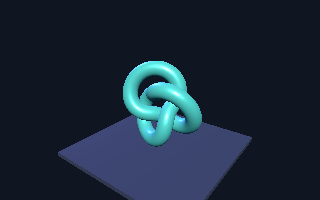
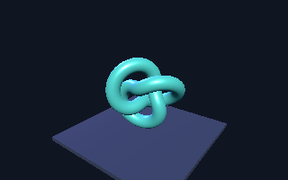

# Rust host, Three.js and canvas lifecycle — 2026-09-18

The Rust player runs upstream Three.js r186 in embedded V8 and produces verified
native Metal pixels. Its new window adapter has passed GPU resource and hidden
window lifecycle checks. **Visible native presentation remains unverified:** the
development Mac was locked and macOS reported the test windows as occluded.
Issues [#15](https://github.com/PANDORMedia/3JSN/issues/15),
[#16](https://github.com/PANDORMedia/3JSN/issues/16),
[#17](https://github.com/PANDORMedia/3JSN/issues/17) and
[#18](https://github.com/PANDORMedia/3JSN/issues/18) remain open.

## Executed evidence

Host: macOS arm64, Apple M1 Pro hardware GPU. Metal API Validation was observed
for the hardware runs. Rust 1.93.0, embedded V8 `15.0.245.2-rusty`, Deno core
0.412.0 and WebGPU 0.226.0; exact dependencies remain in the root lockfile.

| Check | Result |
| --- | --- |
| Upstream Three.js, unchanged shared scene | 320×200 pixels; 14,345 foreground pixels; 5,041 changed pixels between animation states; same JS GPU device; zero captured GPU errors |
| Native canvas lifecycle | Three separate processes, twelve configure/resize/expiry cycles each; dimensions and same-frame identity correct; retained expired textures rejected; zero unexpected GPU errors |
| Error teardown | Each lifecycle run leaves an acquired texture and throws its expected completion sentinel; worker cleanup exits without panic or timeout |
| GPU retention | Exact 64-byte image survives JS source destruction, a second GPU copy and immediate pending-owner drop; destroyed sources are abandoned; destroyed devices fail explicitly |
| Runtime source embedding | Three.js still passes with filesystem reads denied for runtime crate and Cargo registry sources; the denial control fails with `Operation not permitted` |
| CPU regressions | Six Rust tests pass; the hardware-only retention test is additionally run explicitly; all sixteen Node tests pass |
| Static checks | Workspace Clippy with all targets and warnings denied, formatting, source syntax/configuration/link checks pass |

The earlier native-player checks also rejected a missing entry module with its
source error and interrupted a synchronous infinite JS loop at the 30-second
frame-validation deadline. V8 cancellation and safe interruption after isolate
disposal are part of the current CPU regression.

The [Three.js report](2026-09-18-rust-three.json) and
[canvas lifecycle report](2026-09-18-window-lifecycle.json) record input and binary
identities. Both use the same 74,867,264-byte release executable. This is an
observed binary footprint, not a packaged application size or startup benchmark.





The captures were visually inspected. GPU readback is used for assertions and
these images; the native presentation and deferred-image paths use GPU resources.

## Reproduce

```sh
npm run probe:three
npm run probe:window-lifecycle
MTL_DEBUG_LAYER=1 cargo test --locked -p threejs-native-runtime \
  deferred_gpu_snapshot_survives_js_expiry_and_rejects_destroyed_source -- --ignored --nocapture
cargo test --workspace --locked
cargo clippy --workspace --all-targets --locked -- -D warnings
```

GPU commands require access to hardware. The lifecycle probe intentionally
expects exit code 1 only after every assertion and its exact completion sentinel;
an ordinary runtime error or deadline does not pass. Its rendering happens
outside RAF and does not count as visible display evidence.

## Scope and remaining gates

The [window contract](../native-window.md) describes thread ownership, texture
expiry, bounded retry state and known canvas conformance gaps. One pending GPU
image preserves an acquisition-fallback frame without replaying application
callbacks. The pixel test validates that snapshot mechanism; restoration onto a
real visible surface still needs hardware evidence. Failures after normal native
acquisition have a narrower recovery guarantee, and hidden internal copy usage
needs additional WebGPU validation work.

Run clear-frame and Three.js window fixtures after unlocking the desktop, then
exercise minimize/restore, resize/DPI, cancellation, repeated open/close and a
sustained lifecycle scenario. Windows and Linux need their own hardware runs.
No native input, complete DOM/WebGL compatibility, device-loss recovery, CtF
support, build CLI or performance improvement is established by these checks.

Extension-source embedding is documented [separately](runtime-embedding-notes.md).
Application bundling, native library notices and clean-machine packaging remain
independent release gates.
