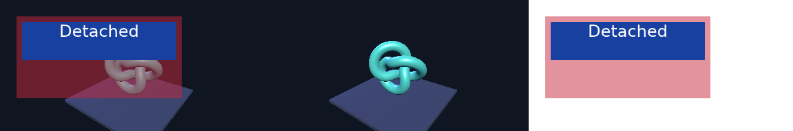
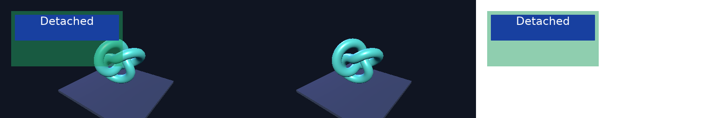

# Three.js and live HTML shared GPU composition — 2026-09-18

**Passed on Apple M1 Pro / Metal.** One V8 realm now runs the unchanged shared
Three.js scene and original DOM fixture, while Vello paints that document onto a
texture sampled by a Deno WebGPU compositor. Both producers use the exact same
native Metal device and command queue. No pixels travel through CPU memory
between either renderer and composition.

[Source and reproduction](../../experiments/native-html-interop/README.md) ·
[Recorded verification](2026-09-18-native-html-interop.json)

This advances [compositor #26](https://github.com/PANDORMedia/3JSN/issues/26),
[HTML architecture #22](https://github.com/PANDORMedia/3JSN/issues/22) and
[paint #24](https://github.com/PANDORMedia/3JSN/issues/24). All remain open.
The experiment supplies a minimal offscreen canvas and manual frame times;
it does not run CtF or certify unchanged web projects.

## Executed checks

| Boundary | Observed result |
| --- | --- |
| GPU identity | Exact native `MTLDevice` and `MTLCommandQueue` pointer checks pass after wrapper registration |
| Submission | 32 Three.js → Vello → composition frames over 4 texture generations; no intermediate image readback/upload |
| Dimensions | 384×192 → 512×256 → 384×192 → 448×224 |
| Composition | 757,760 composite pixels checked across 8 final captures; maximum channel error 1 byte against the independent source-over formula |
| UI | Transparent background, 240-pixel DOM width, 8 glyphs and 405 near-white text pixels per capture; red → green CSS mutation reaches the imported texture |
| Three.js animation | 4,628 / 8,218 / 4,628 / 6,296 changed game pixels between captures |
| Recreation | Returning to 384×192 reproduces all three diagnostic image planes byte-for-byte |
| Import rejection | Mismatched texture dimensions rejected before creating an alias, in all 4 generations |
| DOM | Original 7 supported observations plus 10 shared Event/EventTarget regression checks pass |
| Failure cleanup | Separate process fails intentionally after 2 submitted frames; both registries drain and alias cleanup completes before the expected exit 1 |
| Validation | wgpu validation enabled, Vello `use_cpu=false`, Metal API Validation diagnostic observed; no captured unexpected GPU errors |

Each image contains **composite / game / UI** from left to right. Diagnostic planes
are GPU-written into the final assertion image. The original UI plane has alpha;
its transparent background may appear black in an image viewer.

Both captures were visually inspected. The verification records actual Cargo
versions, compiler, source/shared-input hashes, executable/bundle hashes, per-frame
image hashes and assertions. It publishes no font binary or private game content.

## Ownership and synchronization

Deno WebGPU 0.226.0 uses core/types 29.0.1. Vello 0.10.0 uses the high-level wgpu
29.0.4 wrapper with the same core/types versions and hal 29.0.4. The full resolved
graph is recorded; no dependency patches or raw registry-ID conversions are used.

The high-level wrapper cannot publicly adopt Deno's existing `Arc<Global>` and
device/queue IDs. This experiment therefore has **two registries with independently
retained native objects**. Opening a Metal adapter establishes device provenance;
its temporary unused queue is replaced with Deno's retained native queue. The
adapter then checks exact device and queue identities. This is a Metal-specific
interop boundary, not a shared-core constructor or portable backend solution.

The UI import checks native device, dimensions, format, usages, layers/mips/samples
and tracked hazards. Vello clears every pixel and completes that work before the
unsafe import, so the receiving registry can treat the texture as initialized.
The imported ID transfers directly to one cppgc `GPUTexture`; native ownership
is retained independently from the producer. Host submissions serialize the two
registries and flush Deno pending writes before the Vello phase. Cross-registry
aliasing is not tracked automatically by either validator.

Each bounded batch ends with an assertion-buffer map. Both registries are also
explicitly drained before and after disposal, including when the fallible frame
body returns an error. If a drain itself fails, the process reports failure and
retains the producer until process exit rather than releasing a possibly in-use
native object. The injected error verifies the successful cleanup path; it does
not simulate a hung driver or device loss.

Vello's final shader writes **straight alpha**, confirmed in its pinned
`fine.wgsl`. The compositor multiplies source RGB by alpha before source-over
blending. The independent CPU oracle reads the three final planes and checks the
formula, with separate expected CSS samples. This establishes the tested alpha
contract over an opaque game, not full browser color-space or HDR parity.

## Event integration and remaining limits

The shipping runtime's web globals were extracted into a shared module without
changing their initialization. DOM wrappers extend Deno's EventTarget, so GPU and
DOM objects use the same native Event implementation. New regressions exercise
ancestor-only capture/bubble, pre-cancellation, native prototype calls, readonly
properties, event-path mutation, listener removal and cleanup after rejected
reentrant dispatch.

Deno 0.290 returns early when the target has no listeners for a type. The bounded
Node adapter temporarily adds an inert target listener and removes it in `finally`.
Directly borrowing Deno's prototype dispatch bypasses that workaround. Document
to Window propagation, shadow DOM, default activation and `on*` handlers remain
unsupported. Detached nodes/wrappers remain retained until document destruction;
the checks do not establish long-running DOM memory behavior.

The test does not cover native windows/input, WebGL/ANGLE in the same compositor,
arbitrary canvas/DOM stacking, CSS filters, complete fonts/text/IME/accessibility,
device-loss recovery, Linux/Vulkan, Windows/D3D12 or performance. The executable
depends on research checkout sources at startup. General game packaging and the
`3jsn build` product remain separate work.

## Regression checks

The root workspace's six CPU tests and strict Clippy checks passed after the
web-globals extraction. The 16 Node tests passed with their localhost fixture
servers enabled. The experiment passes strict Clippy independently. The separate
[shipping-player Three.js GPU regression](2026-09-18-native-html-runtime-regression.json)
also passed after the extraction: 14,345 foreground pixels, 5,041 changed pixels,
same JavaScript device and no errors, with Metal API Validation enabled. None of
these checks substitutes for platform-specific presentation tests.
