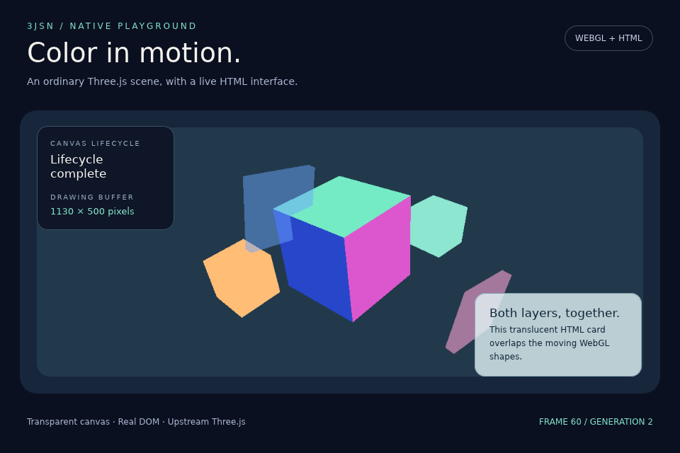

# Native WebGL package inputs — 2026-09-18

The experimental compiled-DOM build now accepts `--angle-package` and packages
ANGLE libraries and supplied redistribution notices beside the application.
Both parser modes built the unchanged public Three/HTML demo. The resulting
packages were moved to paths containing spaces, Unicode and `#`; their disposable
build inputs were deleted.

This checkpoint proves packaged-input loading through the real offscreen GPU
integration test. **The copied executable has not yet presented this package in
a window.** The desktop remains locked. This is not clean-machine, signing,
installer, other-platform, general Three project or complete license-inventory
certification. No native binaries are included in this source archive.

## Package contract

The existing `compiled-dom-window-v1` profile carries the optional
`native-webgl-angle-metal-v1` capability and a strict `nativeWebgl` descriptor.
The two dylibs and `LICENSES` live at fixed paths under `app/native/angle`, with
manifest size/hash verification and bounded reads. Native files cannot also be
font/stylesheet resources. That last role-separation guard was added after the
recorded GPU executables were built and is covered by six CPU rejection cases.

The CLI checks the explicitly supplied `gl@9.0.0-rc.10` metadata, regular-file
boundaries, size limits, measured source/copy identities and final preservation.
Metadata is not authenticated binary provenance. The measured dylibs have arm64
and x86_64 slices and only Apple/system dependencies in `otool -L`; install IDs
are not external sibling dependencies. This does not establish x86_64 execution.

Feature-enabled players advertise the capability. Unsupported players reject the
manifest before realm/window startup. Packaged library selection flows from the
verified manifest through options to the worker, bypassing the ambient ANGLE
library environment variable. Loose-file experiments retain their opt-in path.
Dynamic loading reopens libraries by pathname: packages must remain quiescent,
and integrity checking is not protection against concurrent file replacement.

## Verified behavior

- Preserved and restricted packages each render 60 offscreen Metal frames, five
  lifecycle checkpoints, four export generations and two contexts, then clean up.
- The process runs from `/tmp` with development ANGLE/font/script paths set to
  invalid values. Sandbox rules deny original libraries, font and example source;
  three direct read-denial controls pass in each run.
- Both final 960 × 640 images are byte-identical. The restricted reproducible
  runner also verifies Node is absent from the native child PATH. Network denial
  is configured only, not measured.
- The copied preserved player accepts `--verify-app` with an invalid ambient ANGLE
  path. Corrupting its packaged EGL bytes causes exit 1 with the specific integrity
  error before window startup; bytes were restored afterward.
- The package crate passes **31 tests** and strict all-target Clippy. Player
  preflight passes 14 tests with WebGL, 14 without it, and 12 with the parser
  omitted; shared controls are repeated rather than unique counts.
- Full Node suite: **201 pass, one existing skip**. Scoped WebGL runtime Clippy,
  Rust formatting, JavaScript syntax and 841 source/config/document checks pass. The initial test attempt
  hit disk exhaustion; after removing older generated debug executables, affected
  tests passed. Initial sandboxed Node tests hit loopback `EPERM`; the authorized
  rerun passed.

[Preserved GPU output](2026-09-18-webgl-package/preserved-stdout.txt),
[isolation receipt](2026-09-18-webgl-package/preserved-receipt.json),
[corruption control](2026-09-18-webgl-package/preserved-corruption.json),
[build metadata](2026-09-18-webgl-package/preserved-build.json).
[Restricted GPU report](2026-09-18-webgl-package/restricted-report.json),
[output](2026-09-18-webgl-package/restricted-stdout.txt),
[build metadata](2026-09-18-webgl-package/restricted-build.json).
These identify the actual measured binaries, manifests and inputs.



## Reproduction

Create a disposable project with the public `examples/webgl-window` HTML/module
and a `3jsn.json` selecting `compiled-dom-window-v1` with `entry: "index.html"`.
Use the [build command](../build.md#optional-experimental-angle-payload).
Build the compiled player and `webgl_composition` test with `native-webgl`, adding
`--no-default-features` for restricted mode. After moving the resulting package
and removing the disposable project, invoke:

```sh
node scripts/probe-webgl-package-offscreen.mjs \
  '/absolute/relocated package/app.json' \
  /absolute/webgl_composition-test-binary \
  /absolute/new-evidence-directory \
  /absolute/original/gl-package \
  /absolute/original/font.woff2
```

The script requires macOS, records success/failure output, checks read denial,
consumes the verified package through the integration test, and captures only the
final assertion image. It neither builds nor presents a native surface. Run the
copied executable's 120-frame window test separately once the desktop is unlocked.
